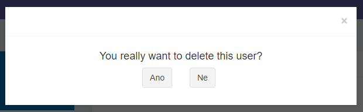

# Confirm

Confirm modal from Nette Framework



Required
 - [doctrine/annotations](http://www.doctrine-project.org)
 - [kdyby/events](https://github.com/kdyby/events)
 - [chomenko/extra-form](https://github.com/chomenko/ExtraForm)
 - [chomenko/modal](https://github.com/chomenko/modal)


## Install


````bash
composer require chomenko/confirm
````

- Configure [kdyby/events](https://github.com/Kdyby/Events/blob/master/docs/en/index.md)
- Configure [chomenko/extra-form](https://github.com/chomenko/ExtraForm)
- Configure [chomenko/modal](https://github.com/chomenko/modal)

And then you should enable the extension using your neon config.

````neon
extensions:
	Confirm: Chomenko\Confirm\DI\ConfirmExtension

#optionally
Confirm:
	translator: Chomenko\Translator\Translator 
````

## Usage
Use annotation ``@Confirm``

in control:

````php
<?php

//Your Presenter or Component

use Chomenko\Confirm\Confirm;

/**
 * @Confirm(
 *     question="You really want to delete this user?",
 *     type=Confirm::TYPE_DANGER
 * )
 *
 * @param int $userId
 * @throws \Nette\Application\AbortException
 */
public function handleRemoveUser(int $userId)
{
	//....
}

````

in latte:

````latte
<a n:href="RemoveUser!, userId => 1">Remove user</a>
````


Confirm options

| Name              | Type                                                                                                 |
|-------------------|------------------------------------------------------------------------------------------------------|
| label             | string                                                                                               |
| question          | string                                                                                               |
| yes               | string                                                                                               |
| not               | string                                                                                               |
| type              | ``TYPE_DANGER``<br />``TYPE_SUCCESS``<br />``TYPE_WARNING``<br />``TYPE_INFO``<br />``TYPE_DEFAULT`` |
| translate         | bool                                                                                                 |
| deniedDestination | string (``Presenter:actin``)                                                                             |
| translateFile     | string                                                                                               |


